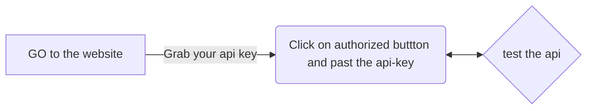

<h1 align="center">Welcome to ghost-auth 👋</h1>
<p>
  <a href="https://www.npmjs.com/package/ghost-auth" target="_blank">
    
  </a>
  <a href="#" target="_blank">
    
  </a>
</p>

> Rapidly integrate authentication and authorization for web, mobile, and legacy applications so you can focus on your core business.


# Quick links

 - **[Get Free API key](ghost-auth.netlify.app)**
 - **[API Documentation](https://ghost-auth-service.herokuapp.com/)**
   
 - **[Ghost auth npm package](https://www.npmjs.com/package/ghost-auth)**

# API Documentation

you can find the API documentation here [LINK](https://ghost-auth-service.herokuapp.com/)
to use the api or the npm package you will need an API-KEY please get your API key from this website [LINK](https://ghost-auth.netlify.app/)

## FLOW



# ghost-auth Documentation

## Install

```sh
npm i ghost-auth
```

## Import

```js
import GhostAuth from "ghost-auth";
```

## Instance

```js
const API_KEY = "YOUR_API_KEY";
const ghost = new GhostAuth(API_KEY);
```

## signUp

```js
ghost
  .signUp({
    email: "souvik@gmail.com",
    password: "souvik@12345",
    name: "souvik",
  })
  .then((d) => {
    console.log(d);
  });
```

## Login

```js
ghost.Login({ email: "souvik@gmail.com", password: "souvik@12345" });
```

## Logout

```js
ghost.Logout().then((d) => {
  console.log(d);
});
```

## IsAuth

```js
ghost.isAuth().then((d) => {
  console.log(d);
});
```

## Author

👤 **souvik666**

- Github: [@souvik666](https://github.com/souvik666)

## Show your support

Give a ⭐️ if this project helped you!

---

_This README was generated with ❤️ by [readme-md-generator](https://github.com/kefranabg/readme-md-generator)_
